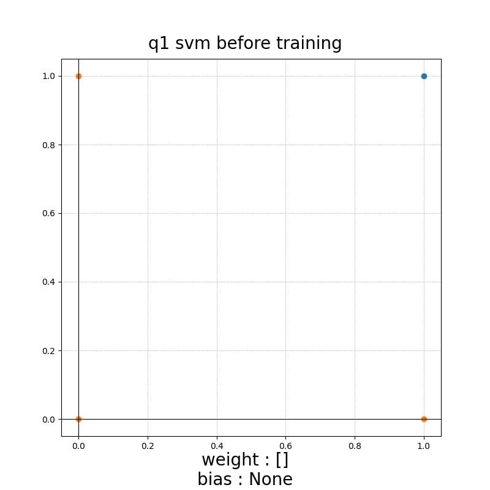
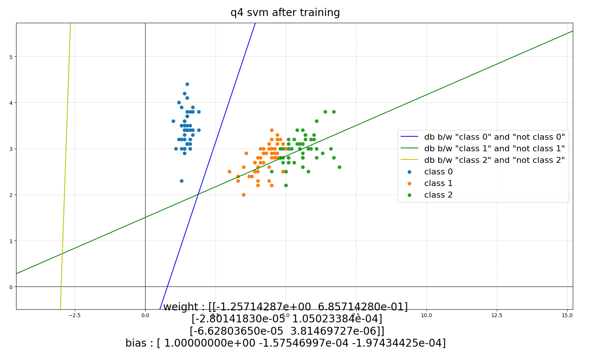

# PR Assignment 4

## COE18B045 - G S Santhosh Raghul
## COE18B048 - Shresta M

# Question 1
Train a **single perceptron and SVM** to learn an AND gate with two inputs x1 and x2. Assume that all the weights of the perceptron are initialized as 0. Show the calulation for each step and also draw the decisionboundary for each updation.

## Perceptron

  

### Iteration 1
  
gradient of Jp = [0 0 2]  
new weight = old weight + learning rate * gradient of Jp  
= [0 0 0] + 0.5 * [0 0 2]
= [0. 0. 1.]

### Iteration 2:
  
gradient of Jp = [-1. -1. -1.]  
new weight = old weight + learning rate * gradient of Jp  
= [0. 0. 1.] + 0.5 * [-1. -1. -1.]
= [-0.5 -0.5  0.5]

### Iteration 3:
  
gradient of Jp = [1. 1. 2.]  
new weight = old weight + learning rate * gradient of Jp  
= [-0.5 -0.5  0.5] + 0.5 * [1. 1. 2.]
= [0.  0.  1.5]

### Iteration 4:
  
gradient of Jp = [-1. -1. -1.]  
new weight = old weight + learning rate * gradient of Jp  
= [0.  0.  1.5] + 0.5 * [-1. -1. -1.]
= [-0.5 -0.5  1. ]

### Iteration 5:
  
gradient of Jp = [-1. -1. -1.]  
new weight = old weight + learning rate * gradient of Jp  
= [-0.5 -0.5  1. ] + 0.5 * [-1. -1. -1.]
= [-1.  -1.   0.5]

### Iteration 6:
  
gradient of Jp = [1. 1. 2.]  
new weight = old weight + learning rate * gradient of Jp  
= [-1.  -1.   0.5] + 0.5 * [1. 1. 2.]
= [-0.5 -0.5  1.5]

### Iteration 7:
  
gradient of Jp = [-1. -1. -1.]  
new weight = old weight + learning rate * gradient of Jp  
= [-0.5 -0.5  1.5] + 0.5 * [-1. -1. -1.]
= [-1. -1.  1.]

### Iteration 8:
  
gradient of Jp = [1. 1. 2.]  
new weight = old weight + learning rate * gradient of Jp  
= [-1. -1.  1.] + 0.5 * [1. 1. 2.]
= [-0.5 -0.5  2. ]

### Iteration 9:
  
gradient of Jp = [-1. -1. -1.]  
new weight = old weight + learning rate * gradient of Jp  
= [-0.5 -0.5  2. ] + 0.5 * [-1. -1. -1.]
= [-1.  -1.   1.5]

### Iteration 10:
  

gradient of Jp = [0. 0. 0.]  
new weight = old weight + learning rate * gradient of Jp  
= [-1.  -1.   1.5] + 0.5 * [0. 0. 0.]
= [-1.  -1.   1.5]  
As there is no significant change in the new weight vector after this iteration, let us stop the training process.

## SVM

  

  
After training, w = [-2 -2] and bias = 3 approximately

# Question 2
Train a **single perceptron and SVM** to learn the two classes in the following table.  
|x1|x2|w|
|--|--|--|
|2|2|1|
|-1|-3|0|
|-1|2|1|
|0|-1|0|
|1|3|1|
|-1|-2|0|
|1|-2|0|
|-1|-1|1|
where x1 and x2 are the inputs and w is the target class. Assume that all the weights of the perceptron are initialized as 0 with learning rate 0.01 and 0.5 separately. Also, tabulate the number of iterations required to converge the perception algorithm with these two learning rates.

## SVM
  

  
After training, w = [-2 2] and bias = 1 approximately

## Perceptron

  

### learning rate = 0.01

### Iteration 1:
  
gradient of Jp = [ -2 -14   0]
new weight = old weight + learning rate * gradient of Jp
           = [0 0 0] + 0.01 * [ -2 -14   0]
           = [-0.02 -0.14  0.  ]

### Iteration 2:
  
gradient of Jp = [ 1.  1. -1.]  
new weight = old weight + learning rate * gradient of Jp  
           = [-0.02 -0.14  0.  ] + 0.01 * [ 1.  1. -1.]  
           = [-0.01 -0.13 -0.01] 

### Iteration 3:
  
gradient of Jp = [ 1.  1. -1.]  
new weight = old weight + learning rate * gradient of Jp  
           = [-0.01 -0.13 -0.01] + 0.01 * [ 1.  1. -1.]  
           = [ 0.   -0.12 -0.02] 

### Iteration 4:
  
gradient of Jp = [ 1.  1. -1.]  
new weight = old weight + learning rate * gradient of Jp  
           = [ 0.   -0.12 -0.02] + 0.01 * [ 1.  1. -1.]  
           = [ 0.01 -0.11 -0.03] 

### Iteration 5:
  
gradient of Jp = [ 1.  1. -1.]  
new weight = old weight + learning rate * gradient of Jp  
           = [ 0.01 -0.11 -0.03] + 0.01 * [ 1.  1. -1.]  
           = [ 0.02 -0.1  -0.04] 

### Iteration 6:
  
gradient of Jp = [ 1.  1. -1.]  
new weight = old weight + learning rate * gradient of Jp  
           = [ 0.02 -0.1  -0.04] + 0.01 * [ 1.  1. -1.]  
           = [ 0.03 -0.09 -0.05] 

### Iteration 7:
  
gradient of Jp = [ 1.  1. -1.]  
new weight = old weight + learning rate * gradient of Jp  
           = [ 0.03 -0.09 -0.05] + 0.01 * [ 1.  1. -1.]  
           = [ 0.04 -0.08 -0.06] 

### Iteration 8:
  
gradient of Jp = [0. 0. 0.]  
new weight = old weight + learning rate * gradient of Jp  
           = [ 0.04 -0.08 -0.06] + 0.01 * [0. 0. 0.]  
           = [ 0.04 -0.08 -0.06]   
As there is no significant change in the new weight vector after this iteration, let us stop the training process.

### learning rate = 0.5
### Iteration 1:
  
gradient of Jp = [ -2 -14   0]  
new weight = old weight + learning rate * gradient of Jp  
           = [0 0 0] + 0.5 * [ -2 -14   0]  
           = [-1. -7.  0.] 

### Iteration 2:
  
gradient of Jp = [ 1.  1. -1.]  
new weight = old weight + learning rate * gradient of Jp  
           = [-1. -7.  0.] + 0.5 * [ 1.  1. -1.]  
           = [-0.5 -6.5 -0.5] 

### Iteration 3:
  
gradient of Jp = [ 1.  1. -1.]  
new weight = old weight + learning rate * gradient of Jp  
           = [-0.5 -6.5 -0.5] + 0.5 * [ 1.  1. -1.]  
           = [ 0. -6. -1.] 

### Iteration 4:
  
gradient of Jp = [ 1.  1. -1.]  
new weight = old weight + learning rate * gradient of Jp  
           = [ 0. -6. -1.] + 0.5 * [ 1.  1. -1.]  
           = [ 0.5 -5.5 -1.5] 

### Iteration 5:
  
gradient of Jp = [ 1.  1. -1.]  
new weight = old weight + learning rate * gradient of Jp  
           = [ 0.5 -5.5 -1.5] + 0.5 * [ 1.  1. -1.]  
           = [ 1. -5. -2.] 

### Iteration 6:
  
gradient of Jp = [ 1.  1. -1.]  
new weight = old weight + learning rate * gradient of Jp  
           = [ 1. -5. -2.] + 0.5 * [ 1.  1. -1.]  
           = [ 1.5 -4.5 -2.5] 

### Iteration 7:
  
gradient of Jp = [ 1.  1. -1.]  
new weight = old weight + learning rate * gradient of Jp  
           = [ 1.5 -4.5 -2.5] + 0.5 * [ 1.  1. -1.]  
           = [ 2. -4. -3.] 

### Iteration 8:
  
gradient of Jp = [0. 0. 0.]  
new weight = old weight + learning rate * gradient of Jp  
           = [ 2. -4. -3.] + 0.5 * [0. 0. 0.]  
           = [ 2. -4. -3.]   
As there is no significant change in the new weight vector after this iteration, let us stop the training process.

## Conclusion

|Learning Rate|Number of Iterations Required|
|--|--|
|0.01|7|
|0.5|7|

We would normally expect the number of iterations required to be different for different learning rates but surprisingly we got the same number of iterations for both. This is because of the fact that the initial weight vector is zero. Because of this, the gradient of Jp (summation of misclassified y) will be the same in the 1st iteration. New weights w <-- w + learning rate * Jp. Clearly, Jp is same for both a  nd only the learning rate differs. So, we can say that w at iter 1 with lr1 = w at i ter 1 with lr2 * some constant. (the constant is in fact lr1/lr2 = 0.01/0.5 = 0.02) Since one weight vector is the scaled version of the other, we can say that both represent the same decision boundary.  
Now, the same thing happens at iteration 2 and again w at iter 1 with lr1 = w at iter 1 with lr2 * (lr1/lr2) ==> both w represent the same decision boundary. This happens at all iterations and the resultant weights at corresponding iterations of the different learning rates essentially represent the same decision boundary.
However, in case of some random initial weight vector instead of a 0 vector, varying the learning rate will bring in differences.

# Question 3
In the given I set of images from poly1.png to poly14.png, let poly1 to poly 7 belong to class 1 and poly 8 to poly 14 belong to class 2. Assume that all the weights of the perceptron are initialized as 0 with the learning rate of 0.01.  
* Identify two discriminant features x1 and x2 for the two target classes w={w1,w2}. Here, w1 - class 1 and w2 - class 2.
* Generate an input feature vector X for all the images mapping them to a corresponding taget classes wi, where i belongs to (1,2).
* Train a **single perceptron and SVM** to learn the feature vector X mapping to w.
* Plot and draw the final decision boundary separating the two classes.

## Choosing and extracting features:
Since there are more green pixels in class 1 than class 2, let us choose x1 as the fraction of "greeinsh pixels" where a "greenish pixel" is defined as a pixel an array of (r,g,b) values where the green value is more than that of both red and blue values.
Similarly we can choose another feature, "reddish pixels" as x2 for the classification purpose.

After calculating, the values are as follows:  

|x1|x2|class|
|--|--|--|
|0.0696443|0.0|0|
|0.22008099|0.0|0|
|0.12225877|0.0|0|
|0.12225877|0.0|0|
|0.08680556|0.0|0|
|0.08841766|0.0|0|
|0.06721722|0.0|0|
|0.0|0.11133429|1|
|0.0|0.11133429|1|
|0.0|0.13755403|1|
|0.0|0.07324398|1|
|0.0|0.12326172|1|
|0.0|0.0656937|1|
|0.0|0.0656937|1|

where 0 corresponds to w1 and 1  corresponds to w2.

## SVM

  
Feature vectors before training

  
After training, w = [15.22 -14.87] and bias = -0.023 approximately

## Perceptron
  

### Iteration 1:
  
gradient of Jp = [-0.77668328  0.68811571  0.]  
new weight = old weight + learning rate * gradient of Jp  
= [0. 0. 0.] + 0.01 * [-0.77668328  0.68811571  0.]  
= [-0.00776683  0.00688116  0.0]

### Iteration 2:
  
gradient of Jp = [0. 0. 0.]  
new weight = old weight + learning rate * gradient of Jp  
= [-0.00776683  0.00688116  0.] + 0.01 * [0. 0. 0.]  
= [-0.00776683  0.00688116  0.]  
As there is no significant change in the new weight vector after this iteration, let us stop the training process in the 2nd iteration itself.

# Question 4
From the iris dataset, choose the ’petal.length’, ’sepal.width’ for setosa, versicolor and virginica flowers. Learn decision boundary for the two features using asingle perceptron and SVM. Assume that all the weights of the perceptron are initialized as 0 with the learning rate of 0.01.  Draw the decision boundary.

This is a multi class problem. Let us try to make the models learn the decision boundary between *class i* and *not class i* for each class.

## Perceptron

  

Since this is a much complicated problem, let us look at iterations 100, 500 and 1000 respectively.

## Iteration 100
  
The decision boundary, db0 between class 0 and not class 0 and the decision boundary between class2 and not class 2 look fine but they can be better. The decision boundary, db1 between class 1 and not class 1 does not look good.

## Iteration 500
  
The decision boundaries db0 and db2 look much better now and separate all of the samples in the test case. The boundary d1 still does not look good.

## Iteration 1000
  
Now, after 1000 iterations, the decision boundaries db0 and db2 look ever so slightly better. But the extra 500 iterations it took to get here might not be worth it after all since it was already close to perfect in the previous case.  
We can see that even after 1000 iterations, db1 does not look good at all. We can also see that it is not moving towards a direction but it is moving in a random direction everytime. This because the boundary between class 1 and not class 1 cannot be linear. (i.e) this region of class 1 is not linearly separable. Since the perceptron algorithm is based on linear algebra, we cannot arrive at a definite positive answer with the perceptron algorithm for this case.

## SVM

  

  
Again, since the dcision boundary between class 1 and not class 1 is not linear, the boundary is inaccurate for the same reasons. The other two boundaries are correctly predicted by the svm.  
  
Here is a better version of the same plot (manually zoomed and panned).